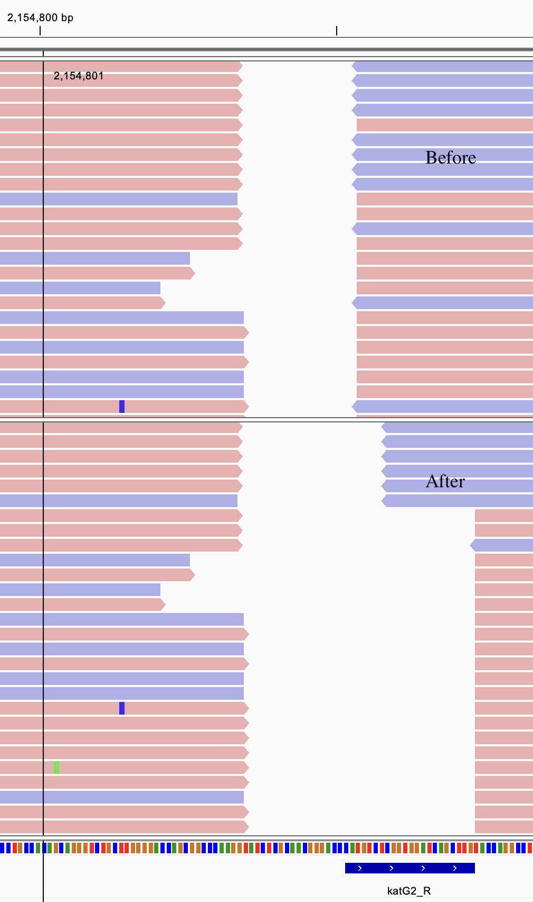
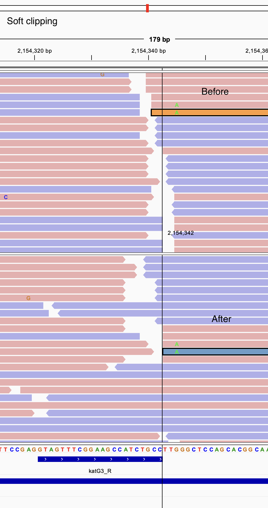
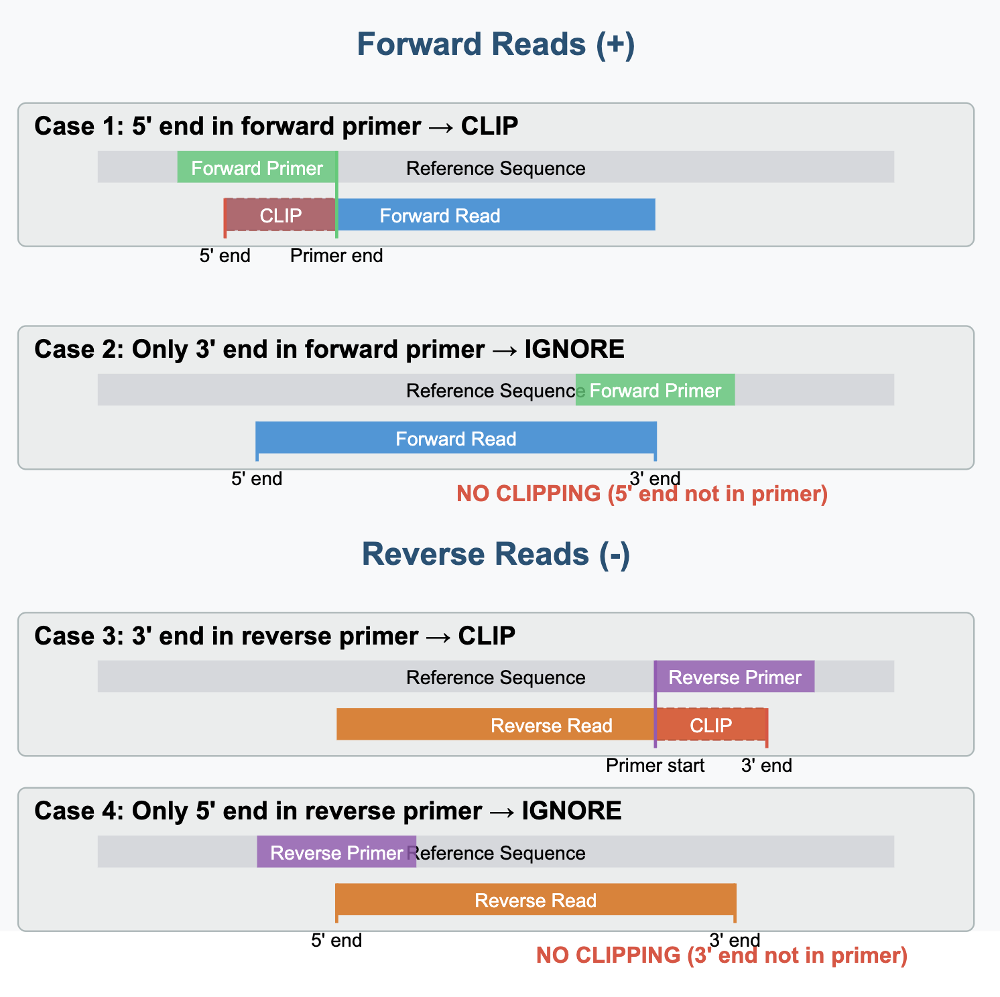

# Primer Soft Clipping Tool

This tool processes BAM files to identify reads that overlap with primer regions and soft clips those regions based on the direction of the read and the primer. It also generates a detailed report of all reads that were screened against primers.

## Installation

### uv
`uv` is used for managing the tool dependencies.

See https://docs.astral.sh/uv/getting-started/installation/#installing-uv

## Usage

```bash
usage: uv run primer_soft_clip.py [-h] -i INPUT_BAM -o OUTPUT_BAM -p PRIMERS -s
                           SCREENED

Soft clip primer regions in BAM file

options:
  -h, --help            show this help message and exit
  -i INPUT_BAM, --input_bam INPUT_BAM
                        Input BAM file
  -o OUTPUT_BAM, --output_bam OUTPUT_BAM
                        Output BAM file
  -p PRIMERS, --primers PRIMERS
                        Primers BED file
  -s SCREENED, --screened SCREENED
                        Output file for screened reads
```
### Output:

1. A modified BAM file where reads overlapping with primer regions have those regions soft clipped. The output BAM file will be automatically sorted and indexed.

Examples:





2. A tab-separated file containing information about all reads that were screened against primers, with columns:
   - read_name: Name of the read
   - chromosome: Chromosome/contig name
   - start: Start position of the read
   - end: End position of the read
   - primer_name: Name of the primer that overlaps with the read
   - primer_direction: Direction of the primer (+ or -)
   - read_direction: Direction of the read (+ or -)
   - action: Whether the read was "soft_clipped" or "skipped"

## BED File Format

The primers BED file should have the following columns:
1. Chromosome
2. Start position (0-based)
3. End position
4. Primer name
5. Score (optional)
6. Strand (required, '+' for forward, '-' for reverse)

Example BED file content:
```
Chromosome	2725853	2725873	ahpC_F	20	+
Chromosome	2726437	2726457	ahpC_R	20	-
Chromosome	1460914	1460934	atpE_F	20	+
Chromosome	1461381	1461401	atpE_R	20	-
Chromosome	1046049	1046071	eis_F	21	+
Chromosome	2715455	2715477	eis_F	22	-
Chromosome	2714908	2714928	MDL_eis-R1	20	+

```

## Soft Clipping Logic



## Testing

The tool comes with a test suite. To run the tests:

```bash
uv run test_primer_soft_clip.py -vvvv
```

## Authors

Thanh Le Viet - Theiagen Genomics - 2025 